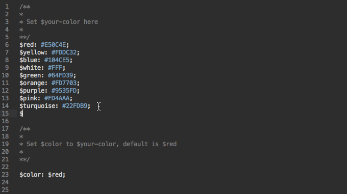

# [Load-icons.css](http://thomaslam.rocks/bower_components/load-icons-css/index.html)

A collection of free pure css loading icons created by [Thomas Lam](http://thomaslam.rocks)

## Browser Support
 |  |  |  | 
--- | --- | --- | --- | --- |
Latest ✔ | Latest ✔ | 10+ ✔ | Latest ✔ | Latest ✔ |

##Usage

Install via bower

```
$ bower install load-icons-css
```

or clone from github

```
$ git clone git@github.com:thomaslam/load-icons.css.git
```
Include link tag in your html file to where you install the load-icons-css package. E.g.

```
<head>
  ...
  <link rel='stylesheet' href='./bower_components/load-icons-css/css/load-icons.css'> 
  ...
</head>
```
Or include individual css files for specific animations.

Then include the appropriate div to where you want the load icon to appear. See all divs [here](http://thomaslam.rocks/bower_components/load-icons-css/index.html).

##Custom color

Go to `/sass/_shared.scss` (it's a Sass file). There are several color variables defined already, or you can create your own color (see below). Set `$color: $your-color`



Then compile Sass into CSS file. See [Sass](http://sass-lang.com/documentation/file.SASS_REFERENCE.html)

All Sass code for animations are in `/sass/icons/` directory. Feel free to customize to your liking.

##License
###MIT License
See LICENSE.md
